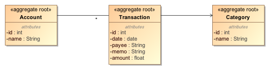

# Manage My Money Server

**This version is replaced with a [new version](https://github.com/nareshbhatia/manage-my-money)**

 *Manage My Money* is a simple application to record and analyze your income and expenses. It demonstrates best practices in developing applications using Node.js and REST. It uses [Knex.js](http://knexjs.org/) and [JoinJS](https://github.com/archfirst/joinjs) for object persistence. The application is based on the [Node REST Template](https://github.com/archfirst/node-rest-template) to provide the basic structure and build system. A full-fledged AngularJS front-end is available [here](https://github.com/archfirst/manage-my-money-client).

## Domain Model


## Requirements

- Install Node
    - on OSX, install [home brew](http://brew.sh/) and type `brew install node`
    - on Windows, use the installer available at [nodejs.org](http://nodejs.org/)

- Install Postgres and postgresql93-devel (development header files and libraries)

- Clone this repo

- Create a database called `manage-my-money` and create the tables needed by the app

        $ cd sql
        $ psql manage-my-money
        manage-my-money=# \i create-schema.sql
        manage-my-money=# \i load-data.sql

- Open a terminal (command line) window

- Type `npm install -g node-inspector node-gyp gulp bunyan`
    - node-gyp is required for `npm install` to succeed
    - bunyan is required for displaying the application log in a human readable format

- Make sure that `server/application/persistence/db.js` has the correct database parameters

## Quick Start
Run the application locally:
```bash
$ npm install
$ gulp serve
```
- `npm install` will install the required node libraries under `node_modules`.
- `gulp serve` will start the application. It is designed for an efficient development process. As you make changes to the code, the application will restart to reflect the changes immediately.
- `npm start` is a quick way to start the application in non-development mode.

To verify that the application is working correctly, point your browser to [http://localhost:8080/accounts](http://localhost:8080/accounts) - you should see a response with a list of accounts in JSON format.

When you deploy the application to a production environment, run the following command to start it without using gulp:

    $ node server/server.js | bunyan -o short

A better way to run the application in production is to start it using forever. This will automatically restart the application in case of a failure:

    $ forever start server/server.js | bunyan -o short

- To debug the application use node-debug (start node-debug on port 9090 because the application itself uses the default port 8080)

    $ node-debug --web-port 9090 server/server.js | bunyan -o short

## Folder Structure

### Highest Level Structure

```
/domain-model
/node_modules
/server
/sql
/test
```

- `domain-model`: A diagram showing application entities and their relationships.
- `node_modules:` Node.js modules downloaded by `npm install` (do not check in)
- `server:` contains all the source files for the RESTful server
- `sql`: scripts for creating the database schema and loading data
- `test:` server tests

### Server Folder Structure

```
/server
    /adapter
    /application
    /domain
    /infrastructure
    /public
```

The server folder contains sub-folders that arrange the application into logical layers as suggested by the [Hexagonal Architecture](http://alistair.cockburn.us/Hexagonal+architecture) (a.k.a. the [Onion Architecture](http://jeffreypalermo.com/blog/the-onion-architecture-part-1/)):

- The `adapter` layer *adapts* interactions from the external world to the application layer. Currently this layer contains only the REST adapter that converts incoming HTTP messages to a format acceptable by the application layer. Technically speaking, database persistence should also be handled in this layer. However because JavaScript does not have the concept of interfaces and dependency injection (at least not very easily), we have embedded persistence in the application layer.

- The `application` layer coordinates high-level activities such as creation of the domain objects and asking them to perform tasks requested by the external world. We also handle relational database persistence in this layer using [Knex.js](http://knexjs.org/) and [JoinJS](https://github.com/archfirst/joinjs).

- The `domain` layer encapsulate the state and behavior of the business domain. It consists of entities and value objects. See [this article](https://archfirst.org/domain-driven-design/) for a detailed description of the domain layer.

- The `infrastructure` layer contains common application facilities such as logging and database initialization.

- The `public` folder contains a simple web page to display the name of the application. Since the primary purpose of this application is to expose a RESTful API, we do not expect to add any more functionality to this folder.

## Tasks

### Task Listing

- `gulp help`

    Displays all of the available gulp tasks.

### Code Analysis

- `gulp vet`

    Performs static code analysis on all javascript files. Runs jshint and jscs.

- `gulp vet --verbose`

    Displays all files affected and extended information about the code analysis.

### Testing

- `gulp test`

    Runs all acceptance tests using cucumber. Depends on vet task, for code analysis. Note that this task will alter the database. To resume normal operation of the application, you must reload the data.

- `gulp autotest`

    Run tests whenever source or test files change.

### Run application for development

- `gulp serve`

    Runs the application using gulp. As you make changes to the code, the application will restart to reflect the changes immediately.

- `node-debug --web-port 9090 server/server.js`

   Launch the application in debug mode.

### Run application in production mode

- `node server/server.js | bunyan -o short`

You may use `forever` to automatically restart the application in case of a failure:

- `forever start server/server.js | bunyan -o short`
